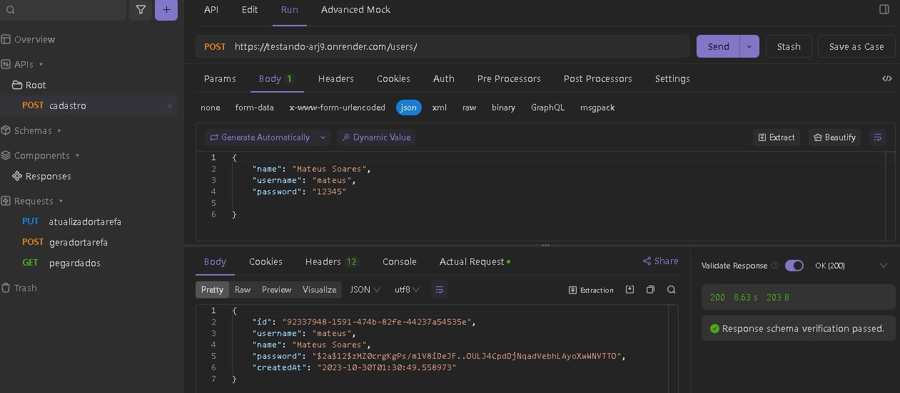

<h1 align="center"> To-do-list </h1>

  

  

## 🚀 Tecnologias

Esse projeto foi desenvolvido com as seguintes tecnologias:

- Java
- Springboot3
- H2 Database Engine
- Maven

## 💻 Projeto

O projeto To-do-list é um registrador de usuários e tarefas.
Os usuários recebem um tratamento de criptográfia (BCrypt) ao cadastrar os ID's.
Registro feito com APIDOG

## 🔖 Layout
Você pode visualizar o projeto através [DESSE LINK](https://dashboard.render.com/web/srv-cklnv3o710pc73dguo50/deploys/dep-ckvggteb0mos739g1gag). É necessário ter conta no [Render](https://dashboard.render.com/) para acessá-lo.

## :memo: Licença

Esse projeto está sob a licença MIT.

---
